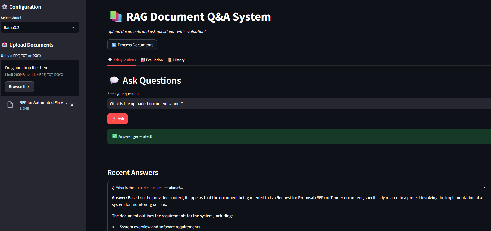
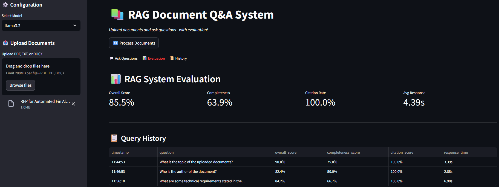
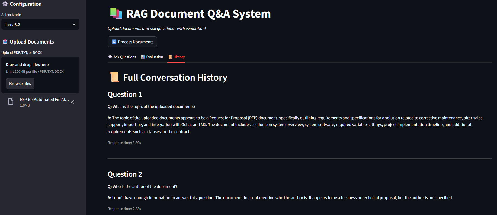

# 🧠 RAG Document QA System


This project demonstrates a complete Retrieval Augmented Generation (RAG) pipeline for document based question answering using local large language models (LLMs). It integrates document ingestion, text chunking, vector embedding, and semantic retrieval with FAISS for efficient similarity search. The retrieved context is dynamically combined with user queries and passed to a local LLM via Ollama, enabling accurate, context aware answers without relying on external APIs. The system is deployed with a Streamlit web interface, offering an intuitive user experience for uploading files, processing documents, and interacting with the model. All 100% locally and offline.


---


## 🔎 Overview


This project demonstrates a complete RAG pipeline that allows users to:

- Upload documents (PDF, TXT, DOCX)

- Ask natural language questions about the content

- Get accurate answers with source citations

- Run everything locally with no cloud costs


Key Features:

- Local LLM execution (Llama 3.2, Mistral, Phi-3)

- Vector similarity search with FAISS

- Document chunking with context preservation

- Source citation and transparency

- Web UI with Streamlit


---

## 🟦 Architecture

<p align="center">
  
</p>

---

## 💻 Demo

<p align="center">
  
  
</p>

<p align="center">
  
</p>


---


## ⚡ Quick Start & Setup

Prerequisites

- Python 3.10+

- Ollama installed

- 8GB+ RAM recommended & Dedicated GPU


Installation


1. Clone the repository

```bash

git clone https://github.com/lutfihadiCEX/rag-document-qa.git

cd rag-document-qa

```

2. Create and activate the Conda environment

```bash

conda create -n rag python=3.10 -y
conda activate rag

```
If you already have an environment set up (e.g. base), you can skip creating a new one, but using a dedicated environment avoids version conflicts.


3. Install dependencies

```bash

pip install -r requirements.txt

```


4. Install and start Ollama

```bash

# Install Ollama from https://ollama.ai


# Pull a model

ollama pull llama3.2       # Recommended - default
ollama pull mistral        # Optional
ollama pull phi3           # Optional


# Start Ollama service (keep terminal open)

ollama serve

```


5. Run the application

```bash

streamlit run ui/streamlit_app.py

```


---

## 👨‍💻 Usage

Via Web UI

1.Upload Documents: Click "Upload Documents" in sidebar

2.Process: Click "Process Documents" button

3.Ask Questions: Type questions in the chat interface

4.View Sources: Expand answers to see source citations

---

## ☰ Tech Stack

- 🦜 LangChain - Document loading, chunking, and RAG pipeline

- FAISS - Vector similarity search for document retrieval

- Sentence-Transformers - Embedding generation

- 🦙 Ollama - Local LLM runtime (Llama 3.2, Mistral, Phi-3)

- Streamlit - Front-end UI

---

## Acknowledgments

- 🦜 LangChain for the RAG framework

- 🦙 Ollama for local LLM inference

- 🤗 Hugging Face for embeddings

- FAISS for vector search

---

## Author

Lutfihadi

## Disclaimer

This project is for research purposes as part of GenAI exploring and learning. Not intended for production use.

---

## Future improvements

- Automated Evaluation: Explore RAGAS or DeepEval metrics (Faithfulness, Relevancy) using a dedicated high parameter "Judge" model (e.g., Llama-3-70B) to avoid self evaluation bias.

- Hardware Optimization: Implement GGUF quantization levels to test larger models on limited VRAM.

- Hybrid Search: Integrate BM25 keyword search alongside FAISS semantic search for better handling of technical acronyms.

- Add multi document context memory
  
- Integrate document summarization using LangChain chains
   
- Dockerize for easier deployment
   


